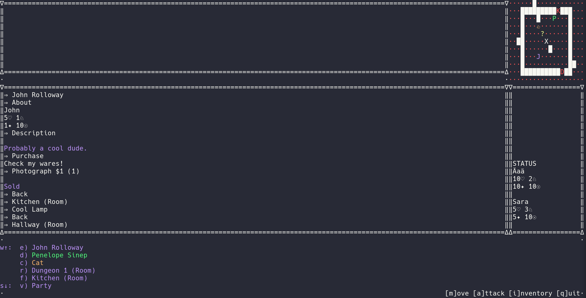

# RPG Interaction System
## About
I was bored over christmas break and decided to build a command-line
rpg system like most nerds do. This system is supposed to be more
dynamic than any basic command-line game since it is more of an
interaction system that can handle any sort of "interpretation."
I've provided two interpretations, a simple cli `python main.py 
--basic`, and a curses version, `python main.py --curses`. 

All demo elements are stored in json files that are read at the 
start of the system. The interaction is based on returned 
dictionaries with `fun` and `vals` keys defining a function that 
could be run (e.g. `d["fun"](*d["vals"])`, which I later learned
should have been replaced with functools's `partial`). 

Almost everything is generalized from the way text is handled to
the personalities different people can have to the inventory held
by different "things." I've decided to make this repository public 
since I realized I would no longer be working with it.

Certain aspects of the curses system are not fully implemented and
they will most likely never be. 

## Building the game
`python3 setup.py build` will create the console executable 
for the text based game. 
